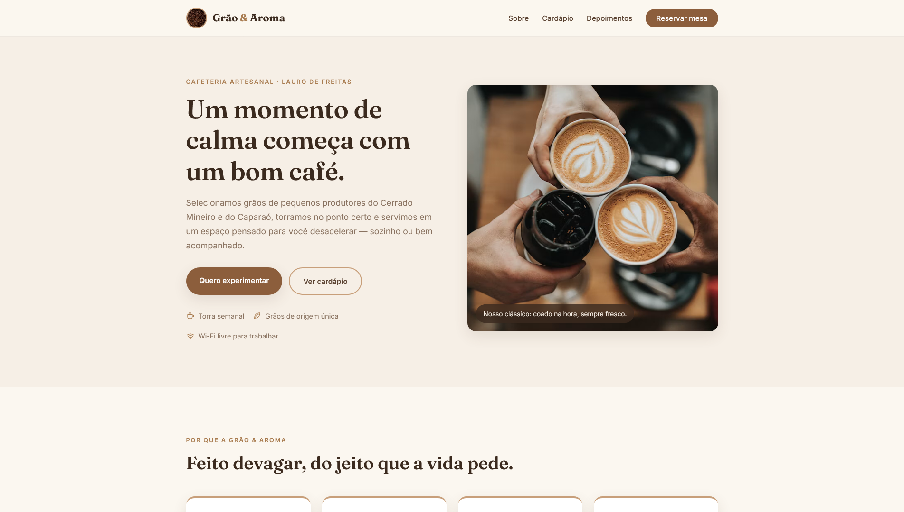

# Grão & Aroma ☕

Landing page de uma cafeteria artesanal, desenvolvida com **HTML5** e **CSS3** como atividade prática do curso Técnico em Desenvolvimento de Sistemas do SENAI. A página apresenta a cafeteria de forma organizada, responsiva e com identidade visual própria.

---

## 📸 Preview



---

## 📖 Sobre o projeto

A **Grão & Aroma** é uma cafeteria artesanal, e esta landing page foi criada para apresentá-la de forma simples e objetiva: o cardápio, a história do negócio, a opinião dos clientes e um canal de contato.

A proposta visual valoriza uma paleta em tons de café (marrom e caramelo sobre fundo claro), com navegação fixa no topo e conteúdo organizado em seções que se adaptam a diferentes tamanhos de tela.

---

## 🎯 Objetivos

- Aplicar na prática os fundamentos de **HTML5** e **CSS3**
- Construir uma página com **estrutura semântica** e organização clara
- Criar layouts com **Flexbox**
- Tornar a página **responsiva** com Media Queries
- Desenvolver uma landing page com aparência profissional e identidade visual própria

---

## ✨ Funcionalidades e seções

- **Menu de navegação fixo** com links internos para as seções da página
- **Hero (banner inicial)** com chamada principal e botão de ação
- **Cardápio** com cards de produtos e preços
- **Sobre nós** com imagem e descrição da cafeteria
- **Depoimento de cliente**
- **Formulário de contato** (nome, e-mail e mensagem)
- **Rodapé** com informações do estabelecimento

---

## 🛠️ Tecnologias utilizadas

- HTML5
- CSS3
- Flexbox
- Media Queries

---

## 📱 Responsividade

A página foi estruturada para funcionar em diferentes tamanhos de tela, do desktop ao celular. O layout se adapta por meio de **Media Queries**, que:

- Empilham os cards do cardápio em telas pequenas
- Ajustam a seção "Sobre" para exibir imagem e texto em coluna
- Reduzem tamanhos de fonte e reorganizam o menu no mobile

---

## 📁 Estrutura do projeto

```
grao-e-aroma/
├── index.html
├── css/
│   └── style.css
├── assets/
│   └── favicon.png
│   └── preview.png
└── README.md
```

---

## ▶️ Como executar o projeto

Como se trata de um projeto apenas com HTML e CSS, não é necessário instalar nada:

1. Baixe ou clone este repositório
2. Abra o arquivo `index.html` diretamente no seu navegador

> 💡 Alternativa: use a extensão **Live Server** do VS Code para abrir a página com recarregamento automático.

---

## 🌐 Acesso ao projeto

- Landing page publicada: https://sennaxz7.github.io/grao-e-aroma-landing-page/

---

## 🎓 Contexto acadêmico

Projeto desenvolvido como atividade prática do curso **Técnico em Desenvolvimento de Sistemas do SENAI**, no contexto da disciplina de **Webdesign / Desenvolvimento Front-End**, com foco na demonstração dos fundamentos de HTML e CSS.

---

## 💡 Aprendizados e conceitos aplicados

| Conceito | Aplicação no projeto |
|---|---|
| HTML semântico | Uso de `header`, `nav`, `section`, `article`, `footer` e `blockquote` |
| Hierarquia de títulos | Títulos organizados de `h1` a `h3` por seção |
| Imagens e `alt` | Imagem da seção "Sobre" com descrição alternativa |
| CSS | Estilização completa em arquivo externo (`css/style.css`) |
| `margin` e `padding` | Espaçamentos consistentes em todo o layout |
| Variáveis CSS | Paleta de cores centralizada em `:root` |
| Flexbox | Menu, cards, seção sobre e formulário |
| Media Queries | Adaptação do layout para mobile |
| Formulários | Formulário de contato com `label`, `input` e `textarea` |
| Pseudo-classes | `:hover` para interação e feedback visual |

---

## 👤 Autor

**Mateus Sena**

- LinkedIn: [Mateus Sena](https://www.linkedin.com/in/mateus-sena-480b0732a/)
- GitHub: [Mateus Sena](https://github.com/Sennaxz7)
